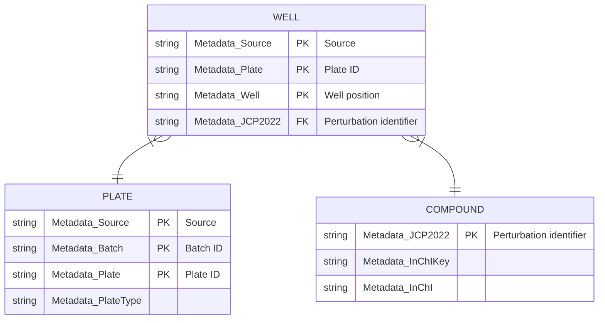

```mermaid
erDiagram
    WELL }|--|| PLATE : ""
    WELL {
        string Metadata_Source PK "Source"
        string Metadata_Plate PK "Plate ID"
        string Metadata_Well PK "Well position"
        string Metadata_JCP2022 FK "Perturbation identifier"
    }
    PLATE {
        string Metadata_Source PK "Source"
        string Metadata_Batch PK "Batch ID"
        string Metadata_Plate PK "Plate ID"
        string Metadata_PlateType
    }
    WELL }|--|| COMPOUND : ""
    COMPOUND {
        string Metadata_JCP2022 PK "Perturbation identifier"
        string Metadata_InChIKey
        string Metadata_InChI
    }
```
