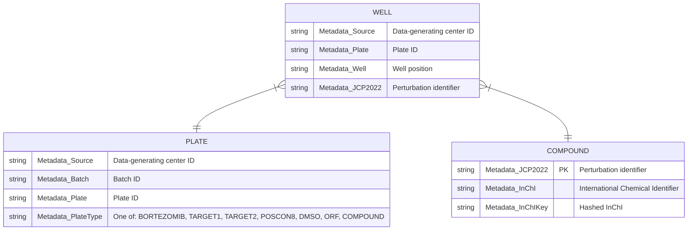

# Metadata

```mermaid
erDiagram
    WELL }|--|| PLATE : ""
    WELL {
        string Metadata_Source "Data-generating center ID"
        string Metadata_Plate "Plate ID"
        string Metadata_Well "Well position"
        string Metadata_JCP2022 "Perturbation identifier"
    }
    PLATE {
        string Metadata_Source "Data-generating center ID"
        string Metadata_Batch "Batch ID"
        string Metadata_Plate "Plate ID"
        string Metadata_PlateType "One of: BORTEZOMIB, TARGET1, TARGET2, POSCON8, DMSO, ORF, COMPOUND"
    }
    WELL }|--|| COMPOUND : ""
    COMPOUND {
        string Metadata_JCP2022 PK "Perturbation identifier"
        string Metadata_InChI "International Chemical Identifier"
        string Metadata_InChIKey "Hashed InChI"
    }
```
