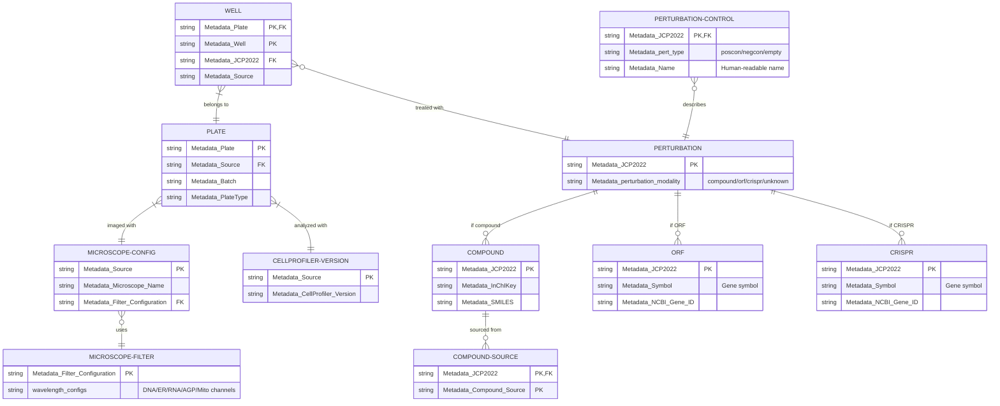

# Metadata

This directory contains experimental metadata for the JUMP Cell Painting Consortium datasets.

## Schema Overview



### Schema Notes

- This diagram shows simplified table structures. See `db/setup.sql` for complete column definitions and documentation.
- The `PERTURBATION` table is created during database setup by combining all compound, ORF, and CRISPR IDs (no separate CSV file).
- `PERTURBATION_CONTROL` defines which perturbations are controls (negcon/poscon/empty) and provides human-readable names (e.g., "DMSO" → JCP2022_033924). Note: The ORF table also has a legacy `Metadata_pert_type` column, but PERTURBATION_CONTROL is now the canonical source for all control designations across compound, ORF, and CRISPR modalities.

## Database Setup

To create a queryable [DuckDB](https://duckdb.org/docs/installation/) database from these CSV files:

```bash
rm -rf db/jump_metadata.duckdb && duckdb db/jump_metadata.duckdb < db/setup.sql
```

This creates a database with:

- Explicit schema with primary and foreign key constraints
- All CSV data imported as tables with data validation
- Documentation for all tables and columns embedded in the schema

## Querying the Database

```bash
# Interactive mode
duckdb db/jump_metadata.duckdb

# UI; available by default for DuckDB versions >= v1.2.1
# https://duckdb.org/docs/stable/core_extensions/ui.html
duckdb -ui db/jump_metadata.duckdb
```

## Schema Documentation

Full schema documentation is embedded in the database. To view:

```sql
-- List all tables with descriptions
SELECT table_name, comment FROM duckdb_tables();

-- View column descriptions
SELECT table_name, column_name, comment 
FROM duckdb_columns() 
WHERE comment IS NOT NULL;

-- View all foreign key relationships
SELECT table_name, constraint_text 
FROM duckdb_constraints() 
WHERE constraint_type = 'FOREIGN KEY';
```

## For Maintainers: Schema Changes

When adding or modifying tables:

1. **Add data file**: Use `.csv` for small tables (<1MB) or `.csv.gz` for larger ones
2. **Update `db/setup.sql`**: 
   - Define table with PRIMARY KEY and FOREIGN KEY constraints
   - Add COMMENT statements for table and columns
   - Update the import section with correct file extension
3. **Test**: `rm -rf db/jump_metadata.duckdb && duckdb db/jump_metadata.duckdb < db/setup.sql`
4. **Update diagram**: Add table to Mermaid diagram above with minimal columns (PKs, FKs, 1-2 key fields)
