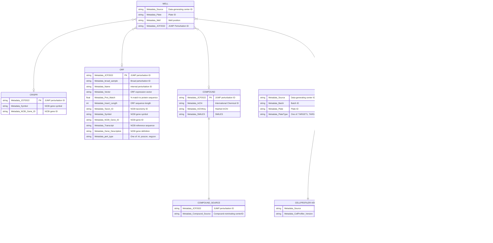

# Metadata

The metadata [schema](https://mermaid-js.github.io/mermaid/#/entityRelationshipDiagram?id=entity-relationship-diagrams) is shown below.

```mermaid
erDiagram
    WELL }|--|| PLATE : ""
    WELL {
        string Metadata_Source "Data-generating center ID"
        string Metadata_Plate "Plate ID"
        string Metadata_Well "Well position"
        string Metadata_JCP2022 "JUMP Perturbation ID"
    }
    PLATE {
        string Metadata_Source "Data-generating center ID"
        string Metadata_Batch "Batch ID"
        string Metadata_Plate "Plate ID"
        string Metadata_PlateType "One of: TARGET1, TARGET2, POSCON8, DMSO, ORF, COMPOUND, COMPOUND_EMPTY"
    }
    WELL }o--o| COMPOUND : ""
    COMPOUND {
        string Metadata_JCP2022 PK "JUMP perturbation ID"
        string Metadata_InChI "International Chemical ID"
        string Metadata_InChIKey "Hashed InChI"
        string Metadata_SMILES "SMILES"
    }
    COMPOUND ||--|| COMPOUND_SOURCE : ""
    COMPOUND_SOURCE {
        string Metadata_JCP2022 "JUMP perturbation ID"
        string Metadata_Compound_Source "Compound-nominating centerID"
    }
    WELL }o--o| ORF : ""
    ORF {
        string Metadata_JCP2022 PK "JUMP perturbation ID"
        string Metadata_broad_sample "Broad perturbation ID"
        string Metadata_Name "Internal perturbation ID"
        string Metadata_Vector "ORF expression vector"
        float Metadata_Prot_Match "% match to protein sequence"
        int Metadata_Insert_Length "ORF sequence length"
        string Metadata_Taxon_ID "NCBI taxonomy ID"
        string Metadata_Symbol "NCBI gene symbol"
        string Metadata_NCBI_Gene_ID "NCBI gene ID"
        string Metadata_Transcript "NCBI reference sequence"
        string Metadata_Gene_Description "NCBI gene definition"
        string Metadata_pert_type "One of: trt, poscon, negcon"
    }
    WELL }o--o| CRISPR : ""
    CRISPR {
        string Metadata_JCP2022 PK "JUMP perturbation ID"
        string Metadata_Symbol "NCBI gene symbol"
        string Metadata_NCBI_Gene_ID "NCBI gene ID"
    }
    PLATE }|--|| MICROSCOPE-CONFIG : ""
    MICROSCOPE-CONFIG {
        string Metadata_Source "Data-generating center ID"
        string Metadata_Microscope_Name "Microscope model name"
        string Metadata_Widefield_vs_Confocal "One of: Widefield, Confocal"
        string Metadata_Excitation_Type "One of: Laser, LED"
        float Metadata_Objective_NA "Objective numerical aperture"
        int Metadata_N_Brightfield_Planes_Min "Min number of brightfield planes taken"
        int Metadata_N_Brightfield_Planes_Max "Max number of brightfield planes taken"
        int Metadata_Distance_Between_Z_Microns "Distance between Z planes in um (only if > 1um)"
        int Metadata_Sites_Per_Well "Number of sites per well"
        string Metadata_Filter_Configuration "Filter configuration ID"
    }
    MICROSCOPE-FILTER ||--|{ MICROSCOPE-CONFIG : ""
    MICROSCOPE-FILTER {
        string Metadata_Filter_Configuration "Filter configuration ID"
        float Metadata_Excitation_Low_DNA "Excitation wavelength min, DNA channel"
        float Metadata_Excitation_Low_ER "Excitation wavelength min, ER channel"
        float Metadata_Excitation_Low_RNA "Excitation wavelength min, RNA channel"
        float Metadata_Excitation_Low_AGP "Excitation wavelength min, AGP channel"
        float Metadata_Excitation_Low_Mito "Excitation wavelength min, Mito channel"
        float Metadata_Excitation_High_DNA "Excitation wavelength max, DNA channel"
        float Metadata_Excitation_High_ER "Excitation wavelength max, ER channel"
        float Metadata_Excitation_High_RNA "Excitation wavelength max, RNA channel"
        float Metadata_Excitation_High_AGP "Excitation wavelength max, AGP channel"
        float Metadata_Excitation_High_Mito "Excitation wavelength max, Mito channel"
        float Metadata_Emission_Low_DNA "Emission wavelength min, DNA channel"
        float Metadata_Emission_Low_ER "Emission wavelength min, ER channel"
        float Metadata_Emission_Low_RNA "Emission wavelength min, RNA channel"
        float Metadata_Emission_Low_AGP "Emission wavelength min, AGP channel"
        float Metadata_Emission_Low_Mito "Emission wavelength min, Mito channel"
        float Metadata_Emission_High_DNA "Emission wavelength max, DNA channel"
        float Metadata_Emission_High_ER "Emission wavelength max, ER channel"
        float Metadata_Emission_High_RNA "Emission wavelength max, RNA channel"
        float Metadata_Emission_High_AGP "Emission wavelength max, AGP channel"
        float Metadata_Emission_High_Mito "Emission wavelength max, Mito channel"
        string Metadata_FPBase_Config "Fluorescence spectra config URL"
    }
    PLATE }|--|| CELLPROFILER-VERSION : ""
    CELLPROFILER-VERSION {
        string Metadata_Source "Data-generating center ID"
        string Metadata_CellProfiler_Version "CellProfiler Version"
    }
```
